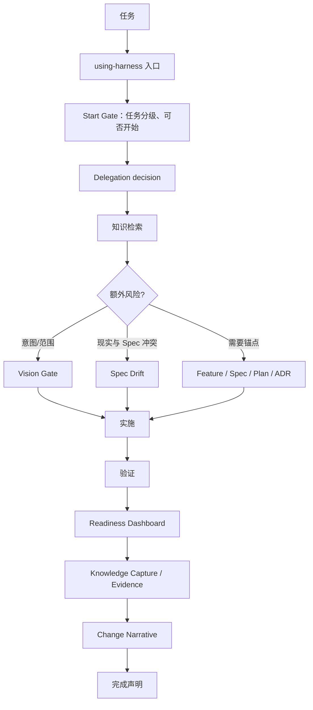
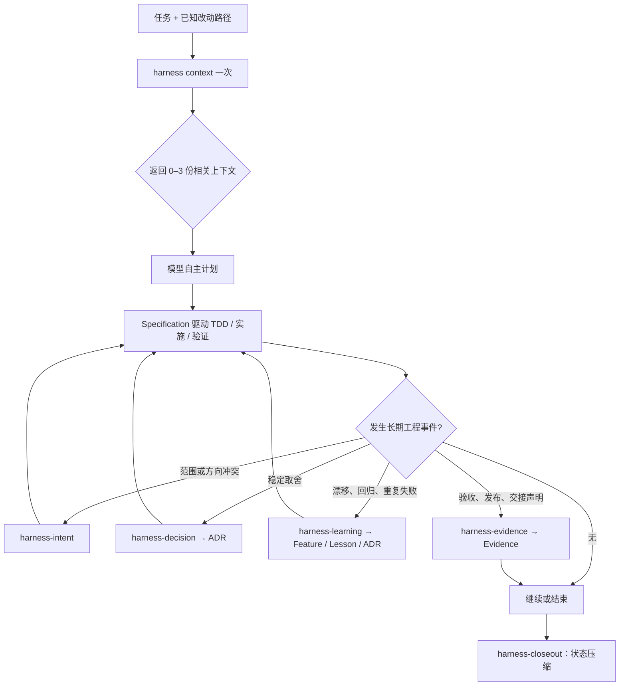

# Harness vNext 重构计划：从默认编排器到按需工程记忆层

> 历史计划说明：本文关于“路径/关键词 Top-1 `context` 召回”的实现细节已被 [ADR-011](../decisions/ADR-011-agent-selected-engineering-index.md) 替代。当前运行时以统一 `docs/INDEX.md` 和主 Agent 语义选择为准；本文其余关于事件触发与去默认 Gate 的背景仍可作为历史材料阅读。

## 1. 决策摘要

本计划将 Harness 从“每个非微小开发任务都必须经过多层 Gate 的编排框架”，重构为“为 GPT-5.6 提供一次精准上下文、SDD 规格、按事件沉淀和轻量收尾的工程记忆层”。

这是一项**不保留运行时兼容层**的大版本重构：vNext 只加载和校验 vNext 的 Skill 与 Schema，不为旧 Gate、旧模板或旧文档 Schema 保留双轨解析逻辑。

这不等于删除历史。现有文档保留为归档来源；真正仍会改变未来决策的设计理由、失败模式和能力规格，应在切换前被选择性地精炼为 vNext 的 Feature、ADR 或 Lesson。vNext 的热路径不扫描或兼容全部旧文档。

### 1.1 理念变化：从约束模型的编排器，转为服务强模型的工程底座

vNext 的变化不是单纯减少 Skill，也不是放弃工程治理。它改变的是 Harness 对“治理应放在哪里”的判断。

旧版的默认理念是：**用流程约束模型，防止模型遗漏工程动作。** 因此，模型需要在开发前后经过多个 Gate，显式证明自己是否已检索、是否偏离目标、是否需要委派、是否足以完成和是否已经沉淀知识。

vNext 的默认理念是：**信任 GPT-5.6 完成常规工程推理；Harness 负责提供模型天然不具备的项目记忆、规格边界与可核验事实。** 普通任务的拆解、实施、测试选择和协作方式交还模型自主判断；只有出现长期工程事件时，才调用相应的意图、决策、学习、证据或收尾能力。

| 维度 | 旧版理念 | vNext 理念 |
| --- | --- | --- |
| 默认控制点 | 约束 Agent 的逐步行为 | 提供正确上下文与可验证边界 |
| 对模型的假设 | 容易遗漏，需要流程补偿 | 能完成常规推理，缺少的是项目专属记忆 |
| Skill 定位 | 开发流程编排器 | 工程记忆、SDD Spec 与验证约束层 |
| 文档定位 | 兼容流程状态、恢复和验收的综合容器 | Feature、ADR、Lesson、Evidence 各自承担单一事实类型 |
| 治理触发 | 非微小工作普遍触发 | 方向冲突、关键取舍、规格漂移、重复失败、发布或交接等事件触发 |

#### 控制权如何迁移

1. **从行为控制迁移到知识与事实控制。**
   旧版主要控制 Agent 是否按既定步骤行动；vNext 主要控制 Agent 是否拥有正确的历史上下文、是否遵守已确认的规格边界、以及其关键声明能否被验证。前者要求过程一致，后者要求结果可恢复、可追溯。
2. **从默认不信任迁移到有边界的信任。**
   vNext 默认相信 GPT-5.6 能够判断任务如何拆分、是否并行、怎样验证、何时结束；但不假定模型知道项目历史、理解已被放弃的方案，或能用自然语言替代真实验证。
3. **从流程状态机迁移到工程事件模型。**
   `Start`、`Vision`、`Delegation`、`Readiness` 不再是每个任务都要穿过的站点。意图冲突、稳定取舍、现实与 Spec 冲突、可复用失败模式、发布/交接声明，才是触发相应治理能力的事件。
4. **从文档收集迁移到领域事实分工。**
   Feature 承载“应具备什么能力”的 Feature 级 SDD Spec；ADR 承载“为何这样取舍”；Lesson 承载“发生过什么失败以及怎样防止重演”；Evidence 承载“这一次实际验证了什么”。任何一份文档都不再兼任完整流程日志。
5. **从完成门禁迁移到状态压缩与声明约束。**
   closeout 仍被保留，因为它能让任务在结束、暂停或上下文压缩时留下明确状态；但它只复用本轮已有事实，输出 `done / partial / blocked`、验证边界和下一安全动作，不再触发新一轮检索、仪表盘或强制文档生产。

#### 不是放弃的能力

以下底层原则**不变**：

- 未来 Agent 不能只靠聊天记录或 diff 猜测“为什么这样设计”与“为什么放弃另一个方案”。
- 完成声明不能替代验证；测试、人工检查、外部状态或其他 Evidence 必须说明其范围与限制。
- 重复失败、回归和错误抽象不能被遗忘；一旦具备复用价值，必须沉淀为可触发的 Lesson 或 ADR。
- 复杂能力必须具备可实现、可测试、可恢复的 SDD Spec；Harness 不依赖外部编排框架才具备这一能力。
- 进度单位仍是可验证能力增量，不是代码行数、文档数量或自然时间。

因此，vNext 不是“弱化的 Harness”，而是把 Harness 从替模型执行工程推理的流程框架，重新定位为让强模型在正确历史、规格和证据约束下发挥的工程底座。

### 目标

- 让 GPT-5.6 自主完成普通任务拆解、实施和验证，避免 Skill 重复要求模型证明它已会做的判断。
- 保留 Harness 独立运行所需的 SDD、历史理由恢复、架构决策、失败防复发与验证证据能力。
- 用一次、可度量的 `harness context` 取代多处反复发生的“是否需要检索”判断。
- 保留简洁 closeout，缓解任务结束时的上下文不确定性；closeout 不再默认创建文档或重跑所有 Gate。

### 非目标

- 不依赖 OpenSpec、Superpowers 或其他编排 Skill 才能工作。
- 不新增 Capability、VISION、Handoff、Spec、Plan、Index YAML 等文档类型。
- 不把“Skill 数量变少”本身当成目标。
- 不把本计划作为“已变快”的性能结论；速度与召回质量必须由真实任务基准证明。

## 2. 目标架构

vNext 保留六个职责清晰、按事件触发的 Skill。`harness context` 是核心 Skill 调用的确定性检索能力，不是第七个需要单独理解的大型 Skill。

| vNext Skill | 触发时机 | 输出与边界 |
| --- | --- | --- |
| `harness` | 开始或恢复有上下文依赖的开发任务 | 仅执行一次 `context`，返回少量上下文包；随后交还模型自主计划与开发。 |
| `harness-intent` | 任务跨 Feature/公共边界、与原始目标或 ADR 冲突、用户要求全局审视时 | 输出 `aligned`、`revise-scope`、`needs-user-decision` 或 `record-decision`；不做常规进出场检查。 |
| `harness-decision` | 出现会影响未来修改的架构、边界、成本或风险取舍时 | 判断是否创建/更新 ADR，并记录取舍与重审条件。 |
| `harness-learning` | 真实行为与 Spec 冲突、重复修补、回归或可复用失败模式出现时 | 判断更新 Feature、创建 Lesson、更新 ADR 或仅修复；不为普通错误强行复盘。 |
| `harness-evidence` | 需要作出完成、发布、交接、验收或关键决策声明时 | 将声明与验证范围、检查、结果和限制绑定为 Evidence；不把所有测试输出都写成文档。 |
| `harness-closeout` | 任务结束、暂停、交接或需要声明当前状态时 | 生成紧凑的 `done / partial / blocked` 状态压缩；只有确有长期价值时才调用其他沉淀能力。 |

### 移除或降级的旧职责

| 旧 Skill / 职责 | vNext 去向 | 原因 |
| --- | --- | --- |
| `using-harness` | 移除，改为精简的 `harness` | 旧入口同时承载路由、Gate、Hook、文档和收尾规则，热路径过重。 |
| `start-gate` | 移除 | 任务分级、是否可开始、是否建 Plan 等常规判断交还 GPT-5.6。 |
| `knowledge-retrieval` | 合并到 `harness context` | 检索应一次完成并可度量，不能由多个 Gate 重复触发。 |
| `vision-gate` | 收敛为 `harness-intent` | 保留全局方向守护，但仅在真正存在方向风险时触发。 |
| `delegation-gate` | 移除 | 模型自主决定单 Agent、并行或独立复核；只有用户明确要求或架构决定需要记录时才留下痕迹。 |
| `spec-drift`、`incident-learning` | 合并为 `harness-learning` | 二者都从真实信号出发，区别由输出产物而非两次路由决定。 |
| `doc-lifecycle` | 并入对应文档的状态和链接规则 | 归档、替代是文档事件，不是日常开发 Gate。 |
| `readiness-dashboard` | 移除 | 普通任务不需要成熟度仪表盘；发布/交接状态由 Evidence + closeout 表达。 |
| `knowledge-capture` | 拆入 decision / learning / evidence / closeout | 先判断发生了什么事件，再选择最小沉淀，而不是统一“捕获”。 |
| `change-narrative` | 不再属于 Harness | 提交说明、PR 说明、普通进展总结由模型原生能力或独立写作 Skill 完成。 |
| `project-rules` | 不再属于 Harness | 项目规则升级必须有人工授权；不应因日常任务自动进入一条 Skill 流程。 |

## 3. 新旧 Skill 执行逻辑

### 3.1 旧版：默认串行 Gate 协议

旧版的主要问题不是每个单独 Skill 都没有价值，而是它们在一次普通开发中对相近状态重复建模：是否开始、是否检索、是否偏离、是否委派、是否可声明完成。



其成本来自：模型在代码工作前后多次阅读规则、重新解释任务状态、判断是否进入下一道流程，并可能重复读取同一组 Feature、ADR、Lesson 或 Evidence。

### 3.2 vNext：上下文一次、事件触发沉淀



vNext 的默认路径只有四步：`context → 自主开发 → 针对性验证 → compact closeout`。任何文档写入或额外判断，都必须由明确事件触发。

### 3.3 `harness context` 的数据流

```text
输入：任务语义、用户已知目标、变更/关注路径
  → 路径精确匹配（优先）
  → Feature Index 粗筛
  → 读取最高相关 Feature
  → 按 Feature 直接链接展开 ADR / Lesson / Evidence
  → 必要时仅允许一跳历史链接
  → 输出：0–3 份上下文文档、命中理由、未命中说明、未解决问题
```

约束：

- 默认最多返回 3 份正文文档；Index 仅用于筛选，不计入正文上下文。
- 没有高置信命中时，明确返回 `no relevant context`，而不是扩大搜索范围。
- 不在 intent、decision、learning、evidence 或 closeout 中重新执行同类检索；它们复用当前上下文包。
- 只在用户明确请求全局审计，或维护 Index 时，进行全量扫描。

## 4. 文档体系与 SDD 分工

vNext 不增加文档类型。其长期记忆模型如下：

```text
Feature = Feature 级 SDD Spec：为什么做、边界、行为规格、验收
ADR     = 关键取舍：为什么选择此方案而非替代方案
Lesson  = 已发生的失败模式：根因和可执行防护
Evidence= 验证事实：某项声明被如何、在何范围内验证
Index   = Feature 的一级粗召回入口
```

`Plan` 可以存在于任务、PR 或其他工具中，但不是 Harness 的长期文档类型；它描述“这一次如何做”。Feature 描述“系统应该具备什么能力”，因此 Feature 是 Harness 独立 SDD 的 Spec 承载体。

### 4.1 通用 Schema 原则

- 文档只记录能改变未来决策的信息，不记录日常流水账。
- 文件名、`owned_paths`、`trigger_terms` 服务召回；正文服务理解与决策。
- 文档之间通过直接链接关联；不建立独立 Evidence Index 或 Plan Index。
- `superseded` 文档必须指向替代文档；归档不等于删除。
- 验证器只校验结构、标识、链接和最小字段，不试图判断设计是否正确。

### 4.2 Feature Schema：Harness 的 Feature 级 SDD Spec

Feature 是唯一需要显著重构的文档。它保留 SDD 所需的规格，却删除旧 Gate 产生的 Intake、时间线、Patch 流水和恢复快照。

```md
---
id: F017
doc_kind: feature
status: draft | active | delivered | archived | superseded
created: YYYY-MM-DD
updated: YYYY-MM-DD
owned_paths:
  - src/example/
trigger_terms:
  - example behavior
---

# F017: <名称>

## Goal
要解决的用户问题、价值和成功状态。

## Scope
### In Scope
### Non-goals

## Specification
### Behavior
可观察的输入、状态与输出行为。

### Rules and Constraints
业务规则、不变量、边界条件。

### Interfaces / Data Contract（按需）
### Failure Behavior（按需）

## Acceptance
- AC-01：Given / When / Then 的可测试场景。
  - 自动化验证：测试文件或测试名称；尚未创建时写预期验证层级。

## Verification Strategy（仅例外时）
仅在 `test-after`、人工验证、外部不可控依赖等偏离默认 TDD 的场景，说明原因和替代验证。

## Current State
当前已具备的稳定行为；active 状态可附下一安全动作。

## Decision Context（按需）
### Why
### Why Not
### If Modifying This Area, Check

## Links
### ADRs
### Lessons
### Evidence
### Related Features
### External Context
```

必填：frontmatter、`Goal`、`Scope`、`Specification`、`Acceptance`、`Current State`、`Links`。`Decision Context` 只在 Feature 本身存在未来可能被误改的关键理由时出现。

以下旧区块从 vNext Feature 中移除：

| 移除区块 | 去向或原因 |
| --- | --- |
| `Vision Anchor`、`Feature Intake` | 收敛至 Goal 与 Scope；整体意图冲突由 `harness-intent` 按需判断。 |
| `Capability Contract` | 用可实现、可验证的 `Specification` 替代。 |
| `Acceptance Map` | 每条 AC 直接声明验证方式；Evidence 记录实际结果，无需第二张映射表。 |
| `State Timeline`、`Patch History` | Git 保存变更时间线；真正可复用的修补原因进入 Lesson 或 ADR。 |
| `Evidence` 独立区块 | 统一放入 Links，避免重复。 |
| `Recovery Snapshot`、`Next Step` | closeout 输出短期状态；只有 active Feature 的必要恢复信息留在 Current State。 |

### 4.3 ADR Schema：决定与重审边界

```md
---
id: ADR-012
doc_kind: adr
status: proposed | accepted | superseded
feature_refs: [F017]
decision_area: <area>
applies_to_paths: []
trigger_terms: []
supersedes: ADR-xxx # 按需
created: YYYY-MM-DD
updated: YYYY-MM-DD
---

## Context
## Decision
## Boundary
## Rejected Options
## Consequences
## Revisit When
## Links / Evidence
```

保留 `Rejected Options`，因为它是防止未来 Agent 重走高成本路线的核心信息。旧 `Before Changing This Decision` 改为 `Revisit When`，表达该决策何时失效、必须重审。

### 4.4 Lesson Schema：失败模式与防护

```md
---
id: LL-008
doc_kind: lesson
status: active | superseded
feature_refs: [F017]
applies_to_paths: []
trigger_terms: []
created: YYYY-MM-DD
updated: YYYY-MM-DD
---

## Signal / Case
## Root Cause
## Resolution
## Protection
## Applies When / Not
## Links
```

`Pitfall` 与 `Principle` 不再作为必有章节；它们经常与 Case、Root Cause 和 Protection 重复。Lesson 必须有真实案例和可执行防护，不能只是泛化提醒。

### 4.5 Evidence Schema：声明约束与验证事实

```md
---
id: EV-024
doc_kind: evidence
feature_refs: [F017]
scope: <scope>
created: YYYY-MM-DD
---

## Supports Claim
## Verification Scope
## Checks
## Results
## Artifacts
## Limitations
```

Evidence 保持近似现有结构，不承载设计理由、后续计划或逐次 TDD 的 Red 阶段日志。它记录最终验证了什么、未验证什么。

### 4.6 Feature Index Schema：低成本一级召回

继续使用 `docs/features/INDEX.md`，不新增索引格式：

| Feature | Status | Trigger Terms | Owned Paths | Read When |
| --- | --- | --- | --- | --- |

Index 只在新增、归档、拆分、合并 Feature，或 `Goal`、`trigger_terms`、`owned_paths` 发生实质变化时更新。普通代码修改、追加 Evidence 或状态微调不更新 Index。脚本负责校验 Index 与 Feature frontmatter 的一致性；开发开始和 closeout 不进行全局 Index 扫描。

## 5. TDD 规则

vNext 将 TDD 置于开发循环，而不是增加测试文档。

```text
Feature Specification
  → 可测试 Acceptance（AC-xx）
  → 失败测试（Red）
  → 最小实现（Green）
  → 重构（Refactor）
  → 相关测试与 Evidence
```

- 对业务规则、状态转换、API/CLI 契约、数据变换、权限、幂等和回归修复，默认采用 test-first。
- 对视觉探索、技术探查、外部不可控依赖、纯文档和不可自动化验证的工作，可采用 `test-after` 或人工验证；必须在 Feature 的 `Verification Strategy` 简要说明原因。
- 测试代码是可执行 Spec；Feature 是业务语义 Spec；Evidence 是本次测试/验证的事实记录。
- 不要求保存每一次失败测试的终端输出，也不以覆盖率数字替代验收场景。

## 6. 实施阶段与交付物

### 阶段 0：建立基准，避免凭感受重构

选取 10–20 个已知结果的真实历史变更，标注每个任务“必须召回”的 Feature/ADR/Lesson。记录当前行为的：

- Top-3 上下文召回覆盖率；
- 关键文档漏召回数；
- 无关正文文档数；
- `no relevant context` 的退出质量；
- 读取文本量、工具调用数和端到端完成时间。

vNext 至少要求：默认上下文不超过 3 份正文文档、关键上下文零静默漏召回、Top-3 覆盖率达到预先确认的目标。端到端速度只在同类任务、同一模型配置下比较后才可宣称改善。

### 阶段 1：确定 vNext 文档基线

- 创建本计划对应的架构 ADR，明确替代 ADR-001、ADR-003、ADR-006 等旧工作流决定的范围。
- 实现 Feature、ADR、Lesson、Evidence 模板与严格校验器的 vNext Schema。
- 更新 Feature Index 校验，读取 `owned_paths` 与 `trigger_terms`，且保持局部校验默认值。
- 建立一组最小正反例测试：缺失必填区块、错误状态、无替代指针的 superseded 文档、Index 不一致、Evidence 缺少声明或限制。

### 阶段 2：实现并评估 `harness context`

- 实现确定性的路径匹配、Index 粗筛、直接链接展开与最多一跳历史读取。
- 输出机器可读的上下文包和人可读的命中理由，方便基准评估。
- 在阶段 0 样本上比较准确率、正文数量、文本量与无命中表现；未达到基准目标前，不删除旧能力。

### 阶段 3：重写六个 vNext Skill

- 每份 `SKILL.md` 仅包含本职责的触发、输入、输出与禁止事项；详细 Schema 放入按需引用文件。
- `harness` 热路径只允许一次 context，不再内置 Start、Vision、Delegation、Readiness 或全量知识校验。
- `harness-closeout` 必须复用本轮已有测试和上下文，不得反向启动检索或文档扫描。
- 默认不安装 PostToolUse 全量文档校验 Hook；严格校验只用于显式文档变更、CI 或需要正式证据的边界。

### 阶段 4：无兼容层切换

- 发布 vNext 为独立版本；旧 Skill 与旧模板不保留为同一运行时中的 fallback。
- 旧文档转为归档来源。只精炼仍有长期价值的内容进入 vNext 基线，不批量机械迁移所有历史过程记录。
- 删除旧 Gate 路由、重复模板、旧 Schema 校验分支及其测试，不保留“根据文件格式自动选择旧流程”的代码。

### 阶段 5：端到端验收

使用基准样本和新任务，覆盖：无上下文小改动、已知 Feature 修改、跨 Feature 意图冲突、架构取舍、重复回归、TDD 行为变更、发布/交接收尾。

验收重点不是“是否每次都生成文档”，而是：正确上下文能否被召回、规格能否驱动实现和测试、重要决定能否恢复、完成声明是否有证据、普通小改动是否不再被流程阻塞。

## 7. 风险与防线

| 风险 | 防线 |
| --- | --- |
| 过度瘦身导致丢失愿景或历史理由 | 保留 intent、decision、learning、closeout；Feature/ADR/Lesson 链接仍是 context 的直接来源。 |
| 把“无兼容”误做成“删除历史” | 保留归档；只精炼仍会改变未来决策的历史，不在热路径解析旧 Schema。 |
| context 过度召回或漏召回 | 先基准后切换；限制 0–3 正文、记录命中理由、对关键漏召回零容忍。 |
| TDD 退化为文档形式主义 | 不创建测试文档；以 AC 场景、测试代码和最终 Evidence 构成闭环。 |
| closeout 再次膨胀为 Exit Gate | closeout 只压缩本轮事实；不重读文档、不跑仪表盘、不强制创建 Evidence。 |
| GPT-5.6 行为随版本或配置变化 | 将模型、推理等级、任务样本和测量方法写入基准 Evidence，定期复测而非永久假定。 |

## 8. 完成定义

本计划本身完成于：Schema、六个 Skill 职责、新旧工作流、TDD 接入、context 数据流、切换策略与基准验收条件都已明确。

真正的 vNext 实现完成需要额外 Evidence 证明：模板和校验器正确、context 在样本上满足召回基准、旧串行 Gate 已不在 vNext 热路径、关键事件仍能生成正确的 ADR/Lesson/Evidence/closeout。
